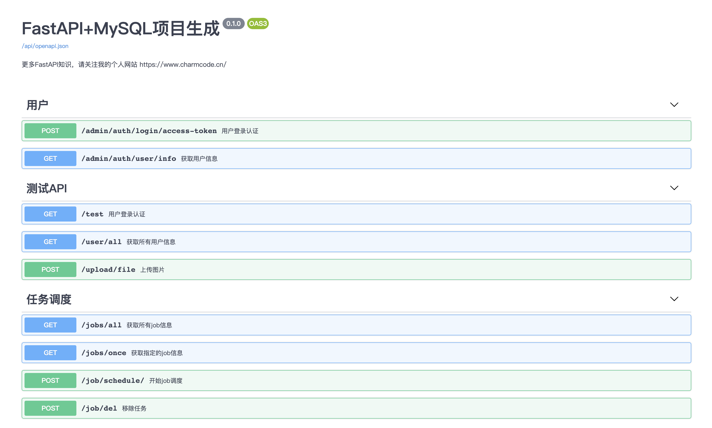
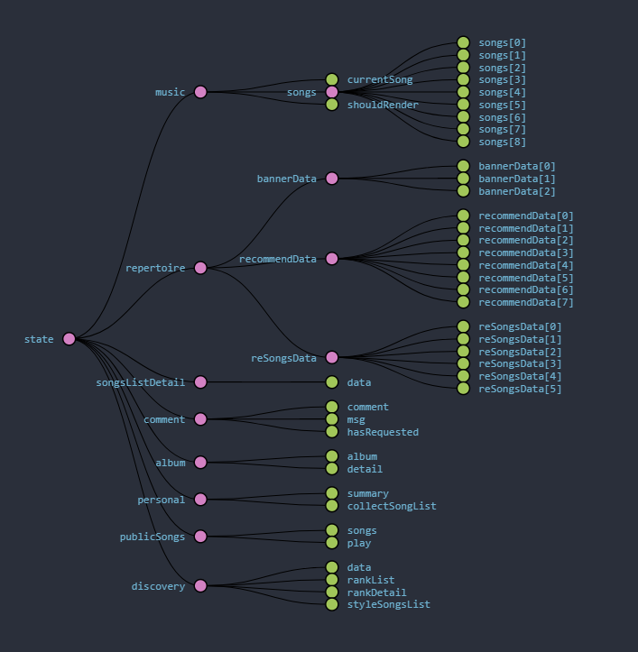
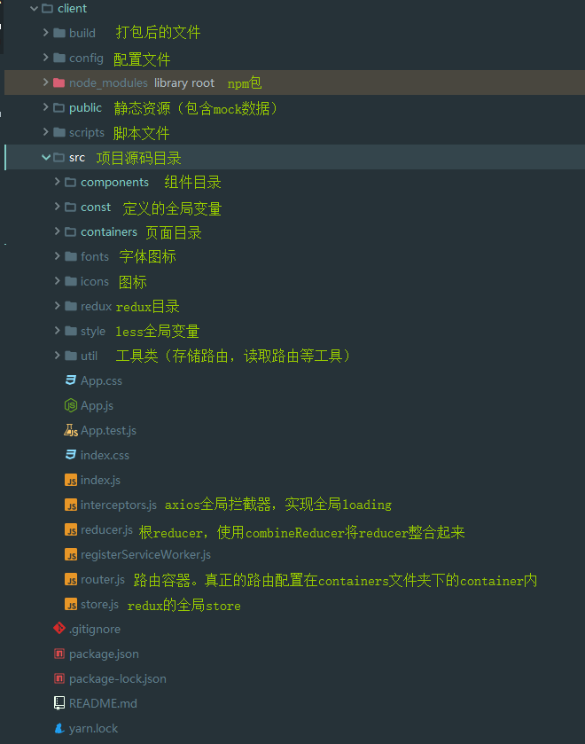


## 简介
使用FastAPI + MySql 作为数据库的项目生成器, 我是参考FastAPI作者[tiangolo](https://github.com/tiangolo)的 [full-stack-fastapi-postgresql](https://github.com/tiangolo/full-stack-fastapi-postgresql) 项目做的。

我把它改成了自己喜欢的格式。很大程度参考了[奇淼 gin-vue-admin项目](https://github.com/flipped-aurora/gin-vue-admin)

## 功能
- JWT token 认证。
- 使用SQLAlchemy models(MySql).
- Alembic migrations 数据迁移.
- redis使用演示.
- 文件上传演示.
- apscheduler 定时任务 (不保证稳定 noqa)
- 基于 casbin 的权限验证 (基于 [gin-vue-admin](https://github.com/flipped-aurora/gin-vue-admin) 复刻)于 gin-vue-admin 复刻)

https://github.com/neroneroffy/react-music-webapp?tab=readme-ov-file

### Redux设计

首先，这次设计的redux貌似不合理。。有几个没必要放到store里共享的状态也放进去了。大家当反面教材吧。。引入redux-thunk中间件，大部分axios请求都放到了redux中。
store内的状态分为8个模块：
- **album** ：专辑模块信息（专辑列表、专辑详情、专辑内歌曲、专辑介绍）；
- **comment** ：评论模块（评论内容、是否已经请求回来，收到的回复（暂未开发））；
- **discovery** ：发现模块（排行榜列表，风格）；
- **personal** ：个人模块（用户信息、收藏歌单，收藏的歌曲数量，歌单数量）；
- **repertoire** ：曲库模块（轮播图、每日推荐数据，曲库好歌）；
- **player** ：播放器内核模块（当前播放的歌曲，待播放歌曲列表，是否应该渲染）；
- **publicSongs** ：公共的歌曲列表，可编辑歌曲列表和播放器内核共用，这样设计的原因是可编辑播放列表内的一键播放功能需要和播放器内核关联起来，如果点击一键播放，那么顺序播放歌单内歌曲，否则播放完成后播放待播放歌曲列表内歌曲；
- **song-list-detail** ：歌单详情；

### 项目结构
